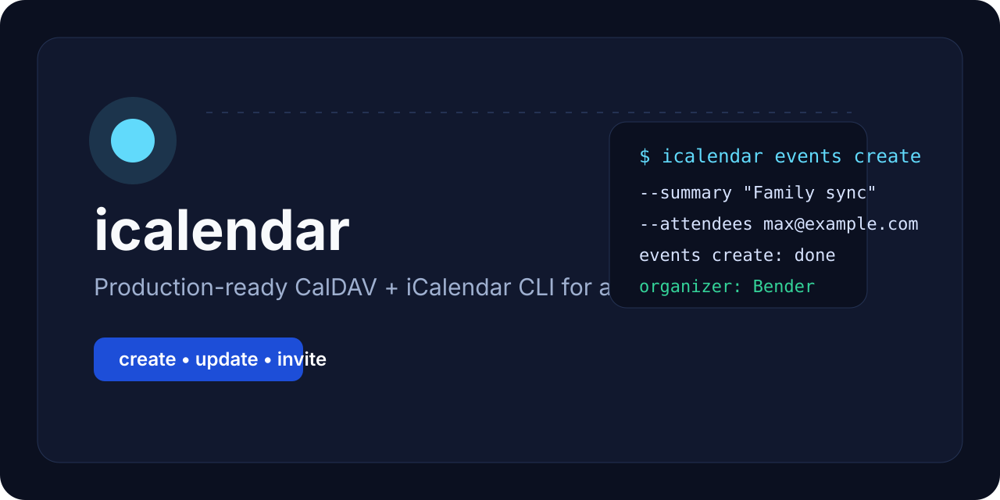
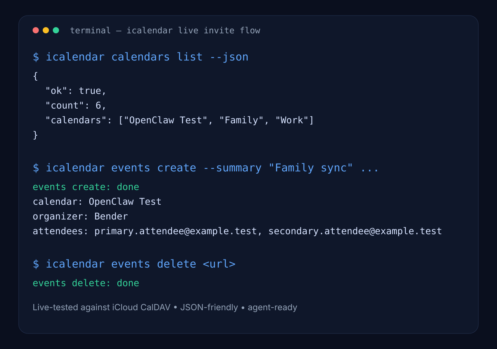

# icalendar

[](https://github.com/cayde-6/icalendar/actions/workflows/ci.yml)
[](https://github.com/cayde-6/icalendar/actions/workflows/release.yml)





Production-ready TypeScript CLI for **CalDAV calendars**, **iCalendar events**, and **agent-friendly automation**.

`icalendar` gives agents and scripts a thin, reliable interface for:
- listing calendars
- listing events
- creating events
- updating events
- deleting events
- sending attendee invites through CalDAV/iCalendar
- setting a friendly organizer display name (for example `Bender`)

It was validated live against **real iCloud CalDAV** with create → update → invite → delete flows.

## Why this exists

Most CalDAV tooling is either too low-level for agents or too UI-centric for automation. This repo wraps the ugly parts behind a small CLI and a layered codebase that is easy to embed, extend, and reason about.

## Features

- ESM TypeScript CLI with clean layering
- CalDAV access via `tsdav`
- invite-ready ICS generation
- attendee support for create/update flows
- configurable organizer common name via env
- text and JSON output modes
- runtime-safe handling of `--help` / `--version`
- live-tested against iCloud CalDAV

## Install

### From source

```bash
git clone https://github.com/cayde-6/icalendar.git
cd icalendar
npm install
npm run build
```

### Use as a local CLI

```bash
npm link
icalendar --help
```

### Use without linking

```bash
node --import tsx src/cli.ts --help
node dist/cli.js calendars list
```

## Configuration

Copy the example file:

```bash
cp .env.example .env
```

Required configuration:

```env
CALDAV_SERVER_URL=https://caldav.icloud.com/
CALDAV_USERNAME=primary.attendee@example.test
CALDAV_PASSWORD=app-specific-password
```

Optional configuration:

```env
CALDAV_CALENDAR_NAME=OpenClaw Test
CALDAV_ORGANIZER_NAME=Bender
CALDAV_RANGE_START=2026-05-07T00:00:00+02:00
CALDAV_RANGE_END=2026-05-08T00:00:00+02:00
CALDAV_EXPAND_RECURRING=true
```

### iCloud note

For iCloud you need an **app-specific password**. Your normal Apple ID password is not enough.

## Quick examples

### List calendars

```bash
icalendar calendars list
icalendar calendars list --json
```

### List events

```bash
icalendar events list
icalendar events list --json
```

### Create an event

```bash
icalendar events create \
  --summary "Family sync" \
  --start "2026-05-07T18:00:00+02:00" \
  --end "2026-05-07T18:30:00+02:00" \
  --description "Agenda review" \
  --location "Belgrade" \
  --attendees "primary.attendee@example.test,secondary.attendee@example.test"
```

### Update an event

```bash
icalendar events update \
  --url "https://caldav.example.com/calendars/personal/event.ics" \
  --summary "Family sync" \
  --start "2026-05-07T18:00:00+02:00" \
  --end "2026-05-07T18:45:00+02:00" \
  --attendees "primary.attendee@example.test,secondary.attendee@example.test"
```

### Delete an event

```bash
icalendar events delete "https://caldav.example.com/calendars/personal/event.ics"
```

## Agent integration

If another agent/session wants to adopt this CLI, start here:
- [Agent integration guide](./docs/agent-integration.md)
- [Architecture](./docs/architecture.md)

Short version:
1. install dependencies
2. provide `.env`
3. run `npm run build`
4. use `icalendar ...` or `node dist/cli.js ...`
5. prefer `--json` for machine consumers

## Development

```bash
npm run check
npm run build
npm test
npm run test:coverage
npm run verify
```

## Test strategy

Current coverage includes:
- calendar selection rules
- time range defaults
- command parsing for create/update/delete
- text/json runtime output
- env config parsing
- ICS generation and ICS parsing
- runtime error rendering

## Architecture

`icalendar` follows the same layered structure as `threads-cli`:

```text
cli -> app(commands/use-cases) -> domain -> infra -> presentation -> shared
```

The CalDAV SDK stays in `infra/`, use-cases orchestrate, domain stays provider-agnostic, and renderers only format output.

## Production-readiness notes

- invite flows were smoke-tested live against iCloud CalDAV
- `--help` and `--version` do not require env credentials
- organizer display name is configurable with `CALDAV_ORGANIZER_NAME`
- attendee invites work in both create and update flows
- CLI defaults to the first calendar when `CALDAV_CALENDAR_NAME` is omitted

## Repo docs

- [Agent integration guide](./docs/agent-integration.md)
- [Architecture](./docs/architecture.md)
- [Release checklist](./docs/release-checklist.md)
- [Versioning policy](./docs/versioning.md)
- [Changelog](./CHANGELOG.md)
- GitHub Actions: `.github/workflows/ci.yml`, `.github/workflows/release.yml`, `.github/workflows/smoke-icloud.yml`

## License

MIT

## Live smoke workflow

A dedicated GitHub Actions workflow is included for optional live CalDAV validation through repository secrets.

Required secrets:
- `CALDAV_SERVER_URL`
- `CALDAV_USERNAME`
- `CALDAV_PASSWORD`

Optional secrets:
- `CALDAV_CALENDAR_NAME`
- `CALDAV_ORGANIZER_NAME`

The workflow creates a temporary event, updates it, and deletes it in the end.
